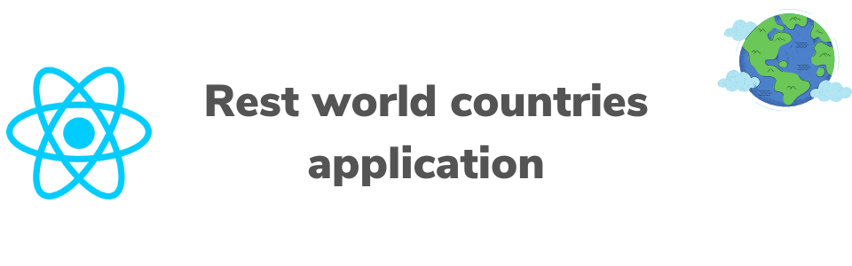

## About the project
This is an react application that gives some information about all countries in the world.

- See all countries on the homepage as a list
- Search for a specific country
- Filter countries by region and name
- Click on a country to see more detailed information on a separate page

## Built with
- [React] (https://reactjs.org/)
- [create-react-app] (https://create-react-app.dev/)
- [Rest Countries API] (https://restcountries.eu/)
- [Styled component] (https://github.com/styled-components/styled-components)

## Getting started

#### Requirements
- [node]
- [npm]

## Package installation
Execute the following command on your terminal to install all the needed packages:
``` npm install ```

## Start the React App
just execute the following command and thats it! 😊

``` npm start ```

